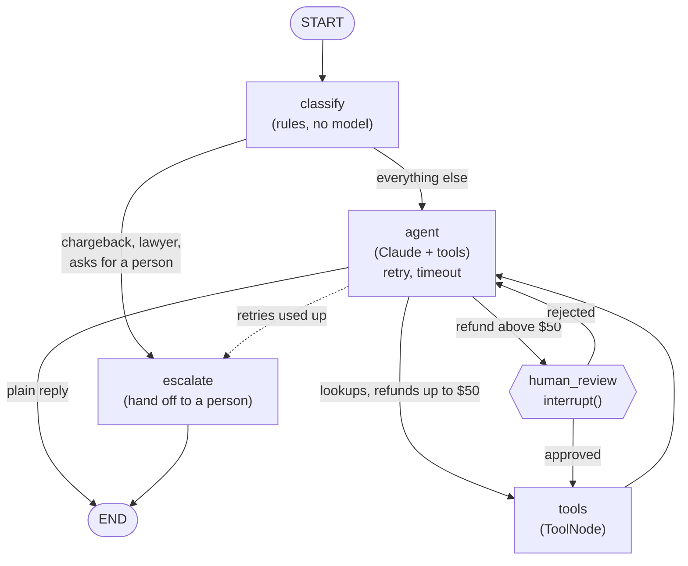

# triage-desk

A customer-support agent built with LangGraph. It sorts incoming messages, looks up orders, answers policy questions, and stops for a human to approve any refund above $50. Conversations are saved to SQLite, so a paused or crashed run can pick up where it stopped.

It is small on purpose: about 1,000 lines of Python across eight modules, one model provider (Anthropic), a fake order system seeded with five orders, and a test suite that runs in a few seconds without an API key.

---

## What it demonstrates

| Concept | Where | Why it matters |
|---|---|---|
| Typed state with reducers | `src/triage_desk/state.py` | `messages` uses LangGraph's `add_messages` reducer, so nodes return only the messages they add and nothing gets overwritten. `review_log` uses `operator.add` as an append-only audit trail. Every other field is last-write-wins. |
| Deterministic and LLM nodes side by side | `src/triage_desk/nodes.py` | `classify` and `escalate` are plain Python (regexes, no model call). Only `agent` calls Claude. The cheap, predictable decisions stay in code you can unit-test. |
| Conditional routing | `route_after_classify`, `make_route_after_agent` | Routing is decided by code that reads the state, not by the model. An angry "chargeback" message goes straight to a person and never reaches the model. |
| Tool calling | `src/triage_desk/tools.py`, `ToolNode` | The model can call `lookup_order`, `search_policy` and `issue_refund`. Tool failures come back to the model as messages it can read and explain. |
| Human in the loop | `make_human_review_node` | Before any refund above the threshold runs, the graph calls `interrupt()`, saves itself and hands control back to the operator. `Command(resume=...)` continues from the same point. |
| Persistence and threads | `AsyncSqliteSaver`, `--thread` | Every step is checkpointed to `data/checkpoints.sqlite` under a thread id. Kill the process at the approval prompt, start it again, and the pending approval is still waiting. |
| Retries, timeouts, fallback | `src/triage_desk/graph.py` | The model node has a `RetryPolicy` (exponential backoff, only for transient errors), a `TimeoutPolicy` (hard cap per attempt) and an `error_handler` that hands the customer to a person once retries run out. |
| Safe side effects | `src/triage_desk/store.py` | Refunds are keyed by the model's tool-call id. If a step is replayed after a crash, the second run finds the first refund instead of paying twice. Money is held as integer cents. |
| Tracing (optional) | `.env` | Set `LANGSMITH_TRACING=true` and a key; LangGraph sends every node, model call and tool call to LangSmith with no code changes. |

The design follows one rule: **hard rules in code, judgement in the model, money above a limit with a person.** The tool refuses refunds on orders that are not delivered, that belong to someone else, or that exceed what is left to refund. The model decides whether a refund is appropriate under the policy. A person approves anything large.

---

## LangGraph in two minutes

If you have not used LangGraph before, these are the only terms you need for this repo:

- **State**: a typed dictionary (here `SupportState`) that every step reads from and writes to. Nodes return partial updates, not the whole state.
- **Reducer**: the rule for merging an update into a field. Without one, a new value replaces the old one. `add_messages` appends to the conversation instead.
- **Node**: a Python function that takes the state and returns an update. It can call a model, run tools, or just run `if` statements.
- **Edge**: which node runs next. A normal edge is fixed; a conditional edge calls a function that looks at the state and returns the next node's name.
- **Checkpointer**: saves the state after every step. With a checkpointer, a run can pause and continue later, even in another process.
- **Thread id**: the key checkpoints are saved under. One thread is one conversation. Different thread ids never see each other's state.
- **Interrupt**: `interrupt(payload)` inside a node pauses the graph and returns `payload` to whoever is running it. Running the graph again with `Command(resume=value)` makes `interrupt()` return `value` and the node carries on.

---

## The graph



You can print the graph LangGraph actually compiled with `triage-desk graph` and paste it into any Mermaid viewer. The dotted edge (the error handler) and the two edges out of `human_review` are chosen at run time, so the generated diagram may draw them differently from the one above.

---

## Prerequisites

- Python 3.11 or newer (LangGraph 1.x needs 3.10+; this project uses `asyncio.Runner`, which arrived in 3.11)
- An Anthropic API key for the live agent. The tests do not need one.
- Optional: a LangSmith API key for tracing

---

## Setup

From the repository folder:

```bash
python -m venv .venv
source .venv/bin/activate          # Windows PowerShell: .venv\Scripts\Activate.ps1
pip install -e ".[dev]"
```

This installs the pinned versions from `pyproject.toml` (LangGraph 1.2.12, langgraph-checkpoint-sqlite 3.1.1, langchain 1.4.2, langchain-anthropic 1.7.4) and the `triage-desk` command.

Then create your environment file:

```bash
cp .env.example .env               # Windows PowerShell: Copy-Item .env.example .env
```

Open `.env` and set `ANTHROPIC_API_KEY`. `.env` is listed in `.gitignore`; keep keys there, never in code. The other settings have working defaults:

| Variable | Default | Meaning |
|---|---|---|
| `TRIAGE_MODEL` | `claude-sonnet-5` | Anthropic model id |
| `REFUND_APPROVAL_THRESHOLD` | `50` | Refunds strictly above this many dollars need a person |
| `LLM_REQUEST_TIMEOUT_SECONDS` | `30` | HTTP timeout for one model request |
| `NODE_TIMEOUT_SECONDS` | `45` | Hard cap on one attempt of the `agent` node |
| `LLM_MAX_ATTEMPTS` | `3` | Attempts for the `agent` node, including the first |
| `CHECKPOINT_DB` | `data/checkpoints.sqlite` | Where conversation checkpoints go |
| `LEDGER_DB` | `data/ledger.sqlite` | Where the fake shop records refunds |

---

## Run it

```bash
triage-desk chat --thread demo --customer cus_maria
```

(`python -m triage_desk chat ...` does the same thing.)

The fake shop has these orders. The agent acts for one customer and cannot see the other customer's orders.

| Order | Customer | Item | Paid | Status |
|---|---|---|---|---|
| A1001 | cus_maria | Wireless headphones | $89.00 | delivered 6 days ago |
| A1002 | cus_maria | Standing desk | $420.00 | delivered 12 days ago |
| A1003 | cus_maria | USB-C cable | $12.50 | in transit |
| A1004 | cus_maria | Coffee grinder | $64.00 | delivered 45 days ago (outside the 30-day window) |
| B2001 | cus_dev | Mechanical keyboard | $149.00 | delivered 3 days ago |

Things to try:

- `Where is my order A1003?` (lookup, no refund)
- `The case on my A1001 headphones is scratched, can I get $20 back?` (small refund, runs straight away)
- `The standing desk from A1002 arrived with a cracked leg. I'd like a partial refund of $120.` (held for approval)
- `I want a full refund for A1004.` (policy says no cash refund after 30 days)
- `Refund B2001 please.` (someone else's order; the tool refuses)
- `I'm filing a chargeback.` (goes straight to a person; the model is never called)

Other commands:

```bash
triage-desk resume  --thread demo   # continue a saved thread, including a pending approval
triage-desk history --thread demo   # print the saved conversation, review log and checkpoint count
triage-desk graph                   # print the compiled graph as Mermaid
triage-desk chat --memory           # in-memory checkpoints; nothing survives exit
```

---

## Demo: a refund that needs approval

An example session, abridged. The model's wording, the order of its tool calls and the refund id will be different on your run. Lines starting with two spaces are the execution trace: one line per node update, printed from `graph.astream(..., stream_mode="updates")`.

```text
$ triage-desk chat --thread demo --customer cus_maria
New thread demo for customer cus_maria. Type 'quit' to leave.
you> The standing desk from A1002 arrived with a cracked leg. I'd like a partial refund of $120.
  [classify] category=refund order=A1002
  [agent] calls lookup_order(order_id='A1002')
  [tools] lookup_order -> {"order_id": "A1002", "item": "Standing desk", "amount_paid": "$420.00", "status": "deliver...
  [agent] calls search_policy(query='partial refund damaged item')
  [tools] search_policy -> [partial-refunds] Partial refunds: for an item that arrived damaged or with parts missing...
  [agent] calls issue_refund(order_id='A1002', amount=120, reason='Desk arrived with a cracked leg')

============================================================
APPROVAL NEEDED: refund above $50.00 for customer cus_maria
  order A1002  amount $120.00  reason: Desk arrived with a cracked leg
Type 'approve' or 'reject', optionally followed by a note.
Or press Ctrl+C: the pause is saved, and 'triage-desk resume' picks it up later.
reviewer> approve photo of the leg checks out
  [human_review] APPROVED $120.00 on A1002 by sam
  [tools] issue_refund -> Refund RF-5C0E91A2 issued: $120.00 on order A1002.
bot> Done: I've refunded $120.00 on your standing desk (order A1002) for the cracked leg. Sorry about the damage.
you> quit
```

What happened, step by step:

1. `classify` matched "refund" and the order id with regexes and wrote `category` and `order_id` into the state. No model call.
2. `agent` sent the conversation, plus a system prompt that includes the category and the threshold, to Claude. Claude asked for `lookup_order`, then `search_policy`. Each time the router saw a tool call that was not a large refund and sent it to `tools`.
3. Claude then asked for `issue_refund` with `amount=120`. The router saw a refund above $50 and sent it to `human_review` instead of `tools`.
4. `human_review` called `interrupt({...})`. The graph saved a checkpoint and returned. The CLI read the pending interrupt from `graph.aget_state(config).interrupts` and printed the approval prompt.
5. The CLI ran the graph again with `Command(resume={"approved": True, "note": "...", "reviewer": "sam"})`. Inside `human_review`, `interrupt()` returned that dictionary, the decision went into `review_log`, and the node sent control to `tools`, which executed the held refund.
6. `agent` saw the tool result and wrote the reply. No tool calls, so the router ended the run.

If you type `reject no photo yet` instead, `human_review` answers the held tool call with a "REJECTED" tool message and sends control back to `agent`, which explains the decision to the customer. No money moves.

---

## Prove persistence works

1. Start a conversation and trigger the approval:

   ```bash
   triage-desk chat --thread persist-1
   ```

   Ask for the $120 desk refund above. When `reviewer>` appears, press **Ctrl+C** (or close the terminal window).

2. Look at what was saved, from a fresh process:

   ```bash
   triage-desk history --thread persist-1
   ```

   You will see the conversation so far, the held `issue_refund` call, `Status: paused, waiting for a reviewer`, and the number of checkpoints written for this thread.

3. Resume the same thread:

   ```bash
   triage-desk resume --thread persist-1
   ```

   The approval prompt comes straight back. Approve it and the run continues from `human_review`, not from the start: the model is not asked again to look up the order, and the refund runs once.

4. Check that threads are separate: `triage-desk history --thread persist-2` reports that no such thread is saved.

The same mechanism covers crashes mid-run. Press Ctrl+C while the agent is working; the last completed step is in SQLite, and `resume` continues from the next node (the CLI calls the graph with `None` as input, which tells LangGraph to carry on from the latest checkpoint). A replayed `issue_refund` does not pay twice, because the ledger is keyed by the tool-call id.

`tests/test_interrupt.py::test_pause_survives_a_restart` checks the same thing automatically: it pauses a run, throws away the graph, the model and the checkpointer connection, builds new ones against the same SQLite file and resumes.

---

## Tracing with LangSmith (optional)

In `.env`:

```bash
LANGSMITH_TRACING=true
LANGSMITH_API_KEY=your-langsmith-key
LANGSMITH_PROJECT=triage-desk
```

EU accounts also need `LANGSMITH_ENDPOINT=https://eu.api.smith.langchain.com`. No code changes are needed: LangGraph sends each run to LangSmith as a trace you can open step by step, with the nodes, the model calls and the tool calls. The CLI prints a warning if tracing is on but the key is empty, because in that case runs succeed silently with no trace.

---

## Tests

```bash
pytest -q
```

The tests replace Claude with `ScriptedModel` (`tests/helpers.py`), a stub that returns scripted replies, raises scripted exceptions, or hangs on purpose. Nothing leaves your machine and no key is needed. They cover:

- `test_routing.py`: the classifier's categories and order-id extraction; every branch of the post-agent router, including "exactly $50 goes through" and "an unreadable amount is held" (fail closed); escalation that never calls the model; a small refund that runs without pausing.
- `test_interrupt.py`: a large refund pauses before any money moves; approval resumes and pays once; rejection returns to the model with no refund; an unrecognised resume value counts as a rejection; a pause survives a restart on the SQLite checkpointer; two threads do not share state.
- `test_reliability.py`: a dropped connection is retried; a programming error is not retried and hands off to a person; retries running out hands off; a hung model call hits the node timeout, is retried, then hands off; a failing tool is reported back to the model; the model cannot reach another customer's order.
- `test_store.py`: refunds are idempotent per tool-call id; over-refunds and in-transit refunds are refused; dollar-to-cents rounding; policy search.

---

## Project layout

```text
triage-desk/
  README.md
  LICENSE
  pyproject.toml            pinned dependencies, the triage-desk command, pytest settings
  .env.example              copy to .env and add your keys
  .gitignore
  src/triage_desk/
    __init__.py
    __main__.py             python -m triage_desk
    config.py               Settings, read from environment variables
    state.py                SupportState: the typed state and its reducers
    store.py                fake order system, policy handbook, SQLite refund ledger
    tools.py                lookup_order, search_policy, issue_refund
    nodes.py                classify, agent, human_review, escalate, routers, error handler
    graph.py                build_graph(): nodes, edges, retry and timeout policies
    model.py                the ChatAnthropic client
    cli.py                  chat, resume, history, graph
  tests/
    helpers.py              ScriptedModel stub and small helpers
    conftest.py              fixtures: settings, store, graph factory
    test_routing.py
    test_interrupt.py
    test_reliability.py
    test_store.py
```

`data/` (checkpoints and the refund ledger) is created on first run and is git-ignored.

---

## If you learned LangGraph from an older tutorial

Some snippets that circulate online no longer match the library. This repo is written against LangGraph 1.2 and the current docs:

| Older snippet | What this repo uses |
|---|---|
| `from langgraph.types import Interrupt` and returning `Interrupt(value=...)` from a node | Call `interrupt(payload)` inside the node; resume with `Command(resume=value)` |
| `graph.invoke(state, resume=True)` | `graph.ainvoke(Command(resume=value), config)` on the same thread id |
| `from langgraph.retry import retry` / `@retry(max_attempts=3)` | `add_node(..., retry_policy=RetryPolicy(...))` |
| `add_node("agent", fn, retry=3, timeout=60)` | `retry_policy=RetryPolicy(...)`, `timeout=TimeoutPolicy(run_timeout=...)` (timeouts apply to async nodes only) |
| `from langgraph.prebuilt import Tool` | `@tool` from `langchain.tools`, executed by `langgraph.prebuilt.ToolNode` |
| `StateNode(call_llm)` | Pass the function straight to `add_node` |
| `create_react_agent` | Still importable in 1.x but deprecated in favour of `langchain.agents.create_agent`. This repo builds its own graph so every step is visible. |
| `ToolNode(tools)` catching every tool error | The current default only catches invalid arguments from the model and re-raises errors from inside the tool. This repo passes `handle_tool_errors=True` explicitly. |

---

## Roadmap

- Swap SQLite for Postgres (`langgraph-checkpoint-postgres`) so several workers can share threads.
- Let the reviewer edit the amount, not just approve or reject, and validate the reply with `interrupt(..., response_schema=...)`.
- A second approval step for refunds above a higher limit (team lead, then finance).
- Split billing and delivery questions into subgraphs once each has more than one tool.
- A LangSmith dataset of recorded conversations to catch routing regressions when the prompt or model changes.
- A small web front end for reviewers, reading pending interrupts across threads.

---

## Licence

MIT. See [LICENSE](LICENSE).
